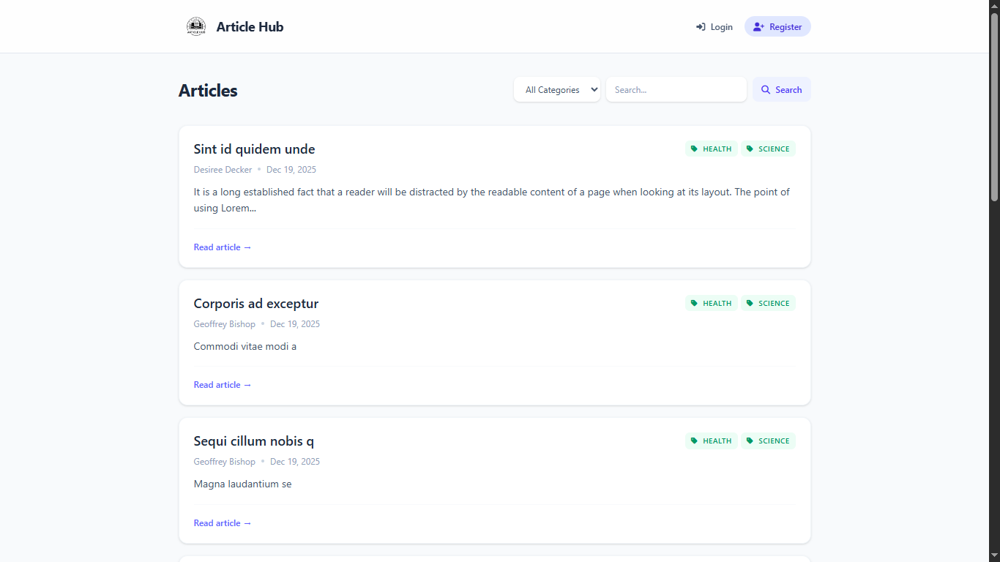

# Article Hub

Article Hub is a modern, full-featured article management system built with **Laravel 12** and **Tailwind CSS 4**. It provides a robust platform for users to publish, manage, and categorize articles, complete with a RESTful API.



> **Note:** This application was created as a technical exam and was completed in approximately 2.5 hours.

## 🚀 Features

### Web Interface
- **Public Access**:
  - 🏠 **Home Page**: Browse the latest articles.
  - 🔍 **Search**: Find articles by keywords.
  - 📂 **Categories**: Filter articles by category (Technology, Health, Science, etc.).
  - 📖 **Read Articles**: View full article details.
- **Authentication**:
  - 🔐 User Registration & Login.
  - 🚪 Secure Logout.
- **User Dashboard**:
  - 📝 **My Articles**: Manage your own articles.
  - ✍️ **Create/Edit**: Rich text editing for articles.
  - 🗑️ **Delete**: Remove your articles.
  - 📊 **Status Management**: Draft vs. Published states.

### API
- **Articles**: CRUD operations for articles.
- **Categories**: Retrieve category details.

## ⚠️ Known Limitations

Due to the time and instructions constraint, the following features were omitted or simplified:
- **Image Uploads**: Articles currently support text content only. No image hosting or upload functionality is implemented.
- **Advanced Search**: Search functionality uses basic SQL `LIKE` queries. Full-text search (e.g., via Scout/Meilisearch) is not implemented.
- **Role-Based Access Control (RBAC)**: There is no "Admin" role. Users can only manage their own articles.
- **Profile Management**: Users cannot update their profile information or change passwords.
- **Comment System**: There is no functionality for readers to leave comments on articles.

## 🛠️ Tech Stack

- **Backend**: [Laravel 12](https://laravel.com) (PHP 8.2+)
- **Frontend**: [Blade Templates](https://laravel.com/docs/blade), [Tailwind CSS v4](https://tailwindcss.com)
- **Build Tool**: [Vite](https://vitejs.dev)
- **Database**: MySQL / SQLite (Configurable)
- **Testing**: PHPUnit

## 📋 Prerequisites

Ensure you have the following installed on your machine:
- [PHP](https://www.php.net/) >= 8.2
- [Composer](https://getcomposer.org/)
- [Node.js](https://nodejs.org/) & NPM

## ⚙️ Installation

1.  **Clone the repository**
    ```bash
    git clone https://github.com/roylandpepano/article-hub.git
    cd article-hub
    ```

2.  **Install PHP dependencies**
    ```bash
    composer install
    ```

3.  **Install Node.js dependencies**
    ```bash
    npm install
    ```

4.  **Environment Configuration**
    Copy the example environment file and configure your database settings.
    ```bash
    cp .env.example .env
    ```
    Update `.env` with your database credentials:
    ```env
    DB_CONNECTION=mysql
    DB_HOST=127.0.0.1
    DB_PORT=3306
    DB_DATABASE=article_hub
    DB_USERNAME=root
    DB_PASSWORD=
    ```

5.  **Generate Application Key**
    ```bash
    php artisan key:generate
    ```

6.  **Run Migrations & Seed Database**
    This will create the tables and populate them with initial data (categories and a test user).
    ```bash
    php artisan migrate --seed
    ```

## 🏃‍♂️ Usage

### Development Server
Start the Laravel development server and the Vite build server in separate terminals:

**Terminal 1 (Laravel):**
```bash
php artisan serve
```

**Terminal 2 (Vite):**
```bash
npm run dev
```

Visit `http://localhost:8000` in your browser.

### Default Login
The seeder creates a default user for testing:
- **Email**: `test@example.com`
- **Password**: `password`

## 🧪 Running Tests

The application includes a comprehensive test suite (Feature and Unit tests).

Run all tests:
```bash
php artisan test
```

## 📂 Project Structure

- **`app/Models`**: Eloquent models (`Article`, `Category`, `User`).
- **`app/Http/Controllers`**: Logic for handling requests (`ArticleController`, `CategoryController`, `AuthController`).
- **`database/migrations`**: Database schema definitions.
- **`resources/views`**: Blade templates for the frontend.
- **`routes`**:
  - `web.php`: Web routes (Browser).
  - `api.php`: API routes.
- **`tests`**: Feature and Unit tests.

## 🔗 API Endpoints

| Method | Endpoint | Description | Auth Required |
| :--- | :--- | :--- | :--- |
| `POST` | `/api/auth/register` | Register a new user | No |
| `POST` | `/api/auth/login` | Login user | No |
| `GET` | `/api/articles` | List all articles | No |
| `GET` | `/api/articles/{id}` | Get article details | No |
| `POST` | `/api/articles` | Create a new article | Yes |
| `PUT` | `/api/articles/{id}` | Update an article | Yes |
| `DELETE` | `/api/articles/{id}` | Delete an article | Yes |
| `GET` | `/api/categories/{id}` | Get category details | No |
